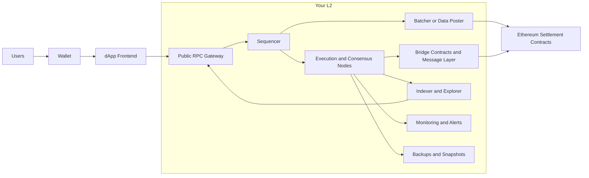
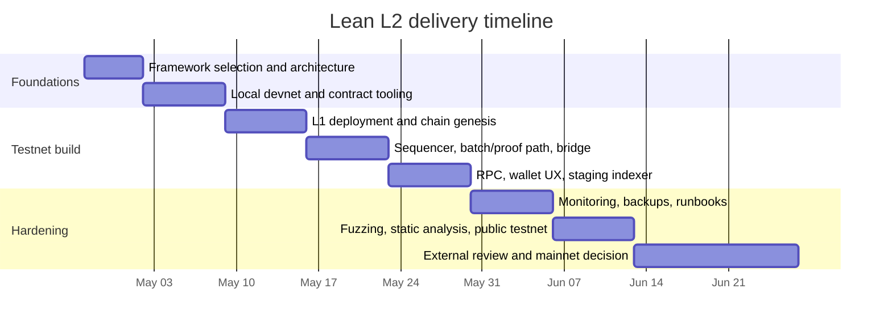

# Building a Budget-Conscious Ethereum L2

## Executive summary

A general-purpose Ethereum L2 for dApps can be prototyped very cheaply, and a credible public testnet can be run mostly on free tiers and open-source software. A responsible mainnet, however, is not realistically “free”: optimistic stacks charge unavoidable L1 data-posting costs, Arbitrum charges parent-chain posting costs through its poster fee model, ZK systems add proving and/or proof-submission overhead, and self-hosting an explorer alone typically exceeds hobby-class infrastructure. Official deployment guides for both the OP Stack and Arbitrum also make clear that production operation involves multiple always-on services, not just one node. citeturn3search0turn3search1turn20search1turn21search0turn11search0

For a small team, minimal budget, and general-purpose dApp positioning, the strongest default is the OP Stack. It is open-source and MIT-licensed, has mature operator documentation, uses the Ethereum toolchain most developers already know, and has a clear deployment flow around `op-deployer`, `op-node`, `op-geth`, `op-batcher`, `op-proposer`, and `op-challenger`. Arbitrum Orbit is the best alternative if you specifically value custom gas-token support, Nitro familiarity, Rollup/AnyTrust flexibility, or eventual child-chain topologies, but its production docs explicitly recommend a RaaS provider and Nitro’s licensing/economic terms matter if you want a chain that settles directly to Ethereum rather than to Arbitrum One or Nova. citeturn20search1turn20search6turn20search2turn20search5turn36search8turn21search5turn32view0

If you want a public testnet soon, a realistic target is roughly three to six weeks for one experienced engineer on an optimistic stack, because the official deployment flows already assume you must deploy L1 contracts, generate genesis files, run sequencing services, wire a bridge, expose RPC, and add operational tooling. A more credible mainnet candidate, with security rehearsal and external review, is closer to eight to twelve weeks on an optimistic stack and longer on ZK-heavy stacks. That timing is an estimate, but it is grounded in the number of mandatory components and operational steps in the official docs. citeturn20search1turn20search6turn21search0turn21search2turn17search3turn23search7

The most practical budget-first strategy is to start with ETH as the gas token on testnet even if you ultimately want a branded base token. Custom gas/base tokens are supported in current Arbitrum, ZK Stack, Polygon CDK, and the wider OP Stack ecosystem, but they add accounting, bridge, and fee-pricing complexity. Arbitrum’s own docs note that custom gas-token fee distribution requires a pricer for parent-chain reimbursements, which is exactly the sort of operational detail that slows a lean launch. citeturn2search13turn2search19turn2search11turn3search2turn2search15

## Strategic assumptions and decision criteria

This report assumes you want a general-purpose EVM-centric L2 for third-party dApps, not just a private appchain for one internal workload. Under that assumption, the decision is dominated by five considerations: operator simplicity, Ethereum compatibility, bridge and wallet UX, sustainable fee economics, and the ability to keep the chain online without paid managed services on day one. The official docs for the leading stacks all emphasise these concerns through their focus on chain components, bridge flows, node configuration, and security posture. citeturn17search4turn21search6turn17search2turn23search2

For this budget profile, the most important trade-off is not “can I deploy contracts?” but “can I operate the chain safely after launch?” That is why optimistic rollup stacks currently dominate the budget-conscious path: their developer experience is more familiar, they are highly EVM-compatible, and the proving burden is lower than on a ZK stack. By contrast, Polygon CDK and ZK Stack can be compelling if you specifically need ZK positioning, but both increase operator complexity and expose you to more moving parts around proof generation, bridge infrastructure, and chain-specific tooling. citeturn20search1turn21search6turn3search2turn23search17turn23search11

There is also a licensing and governance layer to the decision. The OP Stack is described by Optimism as open-source and MIT-licensed. Polygon CDK’s core repository is AGPL-3.0. ZKsync Era is dual Apache-2.0 and MIT. Nitro is deployable freely for chains settling to Arbitrum One or Nova, while direct-to-Ethereum or other settlement topologies point to the Arbitrum Expansion Program and a 10% net-revenue contribution requirement. That does not make Orbit a bad choice, but it does make it a business decision as much as a technical one. citeturn36search8turn30view1turn30view2turn32view0

## Framework comparison

The table below compares the most relevant low-budget choices. “Maturity”, “documentation”, and “deployment complexity” are analytical assessments based on the cited official documentation, repository state, release cadence, and production reference material.

| Framework | Maturity | Primary implementation / languages | Documentation | Deployment complexity | Security model | EVM compatibility | Gas / fee model | Examples | Official sources |
|---|---|---|---|---|---|---|---|---|---|
| OP Stack | High | Primarily Go + Solidity, with some Rust in the monorepo | High | Medium to high | Optimistic rollup on Ethereum; fault proofs are live in the stack, but privileged roles still exist in the current decentralisation path | Very high | Execution gas plus L1 data fee; standard path is ETH-like, with custom gas-token support present in stack references | OP Mainnet, Base | Docs / repo / security model citeturn20search1turn20search6turn23search8turn36search16turn30view0turn33view0 |
| Optimism Superchain path | High | Same core stack as OP Stack | High | Medium | Same core rollup security as OP Stack, plus “standard chain” alignment and Superchain interoperability/governance expectations | Very high | Same as OP Stack | OP Mainnet, Base, other standard-chain deployments in the Superchain ecosystem | Docs / governance / standard-chain reference citeturn23search14turn23search10turn23search18turn20search1 |
| Arbitrum Orbit | High | Primarily Go + Rust + Solidity in Nitro-related repos | High | Medium to high | Nitro-based optimistic architecture; can be Rollup or AnyTrust, so trust assumptions vary by mode | Very high | Child-chain gas plus parent-chain poster fee; supports ETH or standard ERC-20 as gas token, with extra fee-pricing complexity for custom tokens | Reference Nitro chains include Arbitrum One and Nova; custom-chain docs focus more on deployment than on a single showcase page | Docs / Nitro repo / gas docs citeturn21search6turn21search2turn3search1turn3search5turn32view0turn19search1 |
| Polygon CDK | Medium | Primarily Go, with Rust and Solidity in the core repo | Medium | High | Depends on mode: sovereign mode is live and uses Agglayer/pessimistic proofs; validium and zkRollup modes have different DA/prover trust profiles | High for the EVM-oriented CDK variants | Native gas-token support; economics depend on sovereign / validium / zkRollup mode | Official docs include a “Projects Using CDK” showcase and list live/in-development operating modes | Docs / repo / mode architecture citeturn23search1turn3search2turn22search8turn22search5turn30view1 |
| ZK Stack | Medium | Primarily Rust + TypeScript + Solidity in the main repo | High | High | ZK-powered chains with shared L1 contracts and bridges; security anchored to Ethereum plus chain-specific operating choices | High, but not byte-for-byte identical to Ethereum execution assumptions; Solidity/Vyper are supported through an LLVM-based compiler toolchain | Distinct L2 gas and pubdata pricing; custom base tokens are supported | Official current examples on the ZKsync site include ADI Chain and Cari Network; ZK Stack is the framework behind interoperable ZKsync chains | Docs / repo / compiler / examples citeturn23search2turn23search11turn23search17turn3search3turn2search11turn30view2turn36search11turn23search5 |

The key conclusion is straightforward. If your priority is fastest path to a usable public testnet, the OP Stack is the strongest default. If your priority is custom fee-token flexibility and child-chain configuration, Arbitrum Orbit is the best second choice, with the caveat that its own docs recommend professional support for production. If your priority is a ZK narrative or future-proofed proof-based positioning, ZK Stack is the cleanest currently documented self-serve path, while Polygon CDK is attractive but still more mode-fragmented and operationally heavier for a solo or small-team build. citeturn21search5turn17search0turn17search2turn17search3turn23search7

My recommendation for your constraints is therefore: build the first version on the OP Stack, keep ETH as gas on testnet, and postpone both a custom gas token and full “Superchain” alignment until after you have a working public testnet, bridge flow, and operational runbook. That sequence minimises technical risk and avoids introducing fee-token complexity before you have users. citeturn3search0turn20search1turn2search19

## Free and low-cost infrastructure inventory

### Cloud, frontend, CI, and general hosting

| Provider | Current free / low-cost offer | Best use in an L2 build | Biggest limitation | Source |
|---|---|---|---|---|
| GitHub Actions | Free on standard hosted runners for public repos; private repos on GitHub Free get 2,000 minutes/month and 500 MB artifact storage; self-hosted runners are free | CI/CD, contract tests, linting, image builds, release automation | Not persistent infrastructure for sequencers, provers, or explorers | citeturn26search1turn26search3turn4search0 |
| GitHub Pages | Static hosting; published sites up to 1 GB, soft 100 GB/month bandwidth, soft 10 builds/hour | Docs, landing pages, faucet docs, RPC status pages, explorer frontends with static output | Static only; not suitable for nodes or APIs | citeturn4search1turn4search13 |
| Vercel Hobby | Free forever; generous hobby usage with build execution minutes, static hosting, and functions; current docs also describe fair-use transfer/function limits and capped function durations | dApp frontend, docs, lightweight API adapters | Serverless model is the wrong fit for sequencers, explorers, or anything that must never sleep | citeturn24search2turn24search3turn24search4turn24search5 |
| Netlify Free | Current free plan is credit-based with 300 credits/month; deploy previews are free, while bandwidth, compute, and web requests consume credits | Static dApp frontend, docs, lightweight previews | Shared credit pool makes usage less intuitive than older fixed free tiers; not good for chain infra | citeturn25search0turn25search1turn25search4 |
| AWS Free Tier | New-account credits plus service-specific free usage; official pages still advertise EC2/S3 free allowances such as micro-instance time and small S3 storage/request pools | Short-term experiments, object storage, learning environment | More of an introductory programme than a true no-cost permanent home for a public chain | citeturn6search0turn6search3turn5search15 |
| Google Cloud Free | $300 trial plus always-free products such as one e2-micro instance, Cloud Run allowance, and 5 GB Cloud Storage | Small reverse proxy, backups, staging workloads | Always-free compute is too small for reliable public chain infra or explorers | citeturn6search1turn6search4turn5search4 |
| Azure Free | $200 credit, 12-month free services, and always-free services; Azure still lists free VM hours for new accounts | Temporary staging or experiments if you already use Azure | New-account oriented; not a sustainable forever-free environment for chain operators | citeturn6search5turn6search7 |
| Fly.io | No durable “free forever” tier in current docs; the free trial is 2 total VM hours or 7 days, whichever comes first | Short-lived demos only | Not suitable as a real free hosting plan for a public testnet or any chain component | citeturn28view0 |
| Render Hobby workspace | Free web services, static sites, Postgres, and Key Value on the Hobby workspace; free web services get 750 hours/month and spin down after 15 idle minutes; free Postgres is 1 GB and expires after 30 days | Low-traffic staging APIs, demo explorer backend, internal tools | Idle spin-down, ephemeral filesystem, and expiring free database make it unsuitable for critical chain roles | citeturn29search0turn7search0turn7search4turn29search7 |

The practical lesson is simple: free tiers are excellent for CI, docs, demo frontends, staging APIs, static assets, and internal dashboards. They are poor fits for sequencers, batchers, proposers, challengers, provers, or self-hosted explorers because those services must be always-on, stateful, and operationally predictable. citeturn29search0turn11search0turn20search1

### RPC, indexing, and storage services

| Provider | Current free / low-cost offer | Best use in an L2 build | Biggest limitation | Source |
|---|---|---|---|---|
| Infura Core | Free plan with 1 API key, 3 million daily credits, and 500 credits/second; includes supported networks and archive-data access | Backup RPC, wallet-facing read RPC, staging | Daily credit quota and single-key ceiling make it a fallback or dev option, not a sole public mainnet RPC | citeturn35view0 |
| Alchemy Free | 30M compute units/month, 25 requests/second, 5 apps and 5 webhooks | Primary dev/test RPC, webhook-based indexing, simple production pilots | Free throughput is fine for early traffic but not for serious public-chain load | citeturn35view1 |
| The Graph Studio | Official docs state that deployed subgraphs in Studio are free, rate-limited, private, and intended for development, staging, and testing; production publication goes to the decentralised network | Index dApp contracts during dev/test without self-hosting `graph-node` | Not public and not intended as a production-grade free endpoint | citeturn27search0 |
| Self-hosted The Graph stack | Open-source route using `graph-node`, PostgreSQL, RPC, and IPFS | Full control if you already run infra | Operationally heavy; The Graph’s own documentation argues self-hosting is materially more expensive and labour-intensive than using the network | citeturn9search1turn9search5 |
| IPFS self-hosted | Open protocols, self-hostable with Kubo or IPFS Desktop; persistence depends on pinning | Store metadata, static assets, docs snapshots, NFT/media assets | Content is not durable unless pinned and kept available; you must manage persistence yourself | citeturn10search3turn10search7turn10search16 |
| Pinata Free | Free plan includes 1 GB storage and 1 gateway | Managed pinning for a small asset set, metadata, and static dApp bundles | Tiny storage budget for anything beyond a prototype | citeturn35view2 |

For the lowest-friction build, the best free-tier mix is: GitHub Actions for CI, GitHub Pages or Vercel for documentation and frontend, one primary RPC from Alchemy plus one fallback from Infura, The Graph Studio for staging subgraphs, and Pinata or self-hosted IPFS for asset persistence. That setup is enough for a strong developer preview and a modest public testnet, but not for a production-grade public mainnet. citeturn26search1turn4search1turn24search2turn35view1turn35view0turn27search0turn35view2

## Technical architecture and deployment checklist

A minimal viable public L2 architecture has more parts than most first-time builders expect: L1 settlement contracts, a sequencer, a batch/data-posting service, a state-root proposer or proof path, a bridge, public RPC, a wallet flow, indexing, monitoring, and backups. The official OP Stack deployment sequence literally walks through these services step by step, and Arbitrum’s chain-operator docs split the work into chain deployment, node configuration, and token-bridge deployment. citeturn20search1turn21search0turn21search2turn21search4



This architecture is intentionally generic so that it works whether you choose OP Stack, Orbit, CDK, or ZK Stack. The specifics differ, but the operator responsibilities are the same: get transactions in, publish data or proofs to Ethereum, expose reliable reads, and make recovery straightforward when something fails. citeturn20search1turn31search3turn23search17turn23search20

### Deployment checklist

1. **Pick the framework and keep the first environment boring.**  
   For your constraints, “boring” means an optimistic stack, Sepolia as the parent chain, ETH as the gas token, and no custom bridge UX on day one. That removes the most common early failure modes. citeturn17search0turn21search2turn3search0

2. **Build a local devnet first.**  
   Use the official quickstart path to bring the chain up locally or on a local-enclave tool such as Kurtosis for CDK development. ZK Stack’s local quickstart and Polygon CDK’s local deployment path exist specifically for this reason. citeturn17search3turn17search18turn23search7

3. **Move to a private or team testnet before opening it publicly.**  
   In OP Stack terms, that means L1 contract deployment, validation, genesis creation, then sequencing, batching, proposing, and challenging. In Arbitrum terms, it means chain deployment, node configuration, and token bridge deployment. citeturn20search1turn20search6turn20search2turn20search5turn21search0turn21search2turn21search4

4. **Budget sequencer economics before you expose the chain.**  
   OP Stack transaction fees include an L1 data fee, Arbitrum charges a poster fee for parent-chain posting costs, and ZK systems expose proof- and pubdata-related economics. Even if users pay fees in a custom token, your operator path still needs L1-side value and fee accounting. citeturn3search0turn3search1turn3search3turn3search11turn2search19

5. **Expose RPC through at least two upstream providers.**  
   For a cheap public testnet, a sensible pattern is one primary hosted RPC account and one fallback. This is where Alchemy plus Infura is useful. Do not present a single free-tier provider as production-grade availability. citeturn35view1turn35view0

6. **Do wallet onboarding early, not late.**  
   Make MetaMask add-network flows part of week one of public testing, publish chain metadata clearly, and pre-fill RPC URLs and chain IDs for users. MetaMask itself warns that third-party network registries such as Chainlist are convenient but should be checked for correctness. citeturn11search1turn11search5

7. **Use the framework’s bridge path first.**  
   Arbitrum provides official bridge quickstarts and specific guidance for adding your own chain to the Arbitrum bridge UI. OP Stack and ZK Stack also document bridge and message flows. Do not make “bridge shopping” your first launch problem. citeturn22search0turn22search3turn3search19turn23search13turn23search15

8. **Delay the self-hosted explorer unless you already have paid compute.**  
   Blockscout is the right open-source explorer to know, but its own deployment docs list minimum hardware in the range of multiple cores, 8–32 GB RAM, and substantial disk. That is already beyond what a hobby free tier responsibly supports. citeturn11search0turn11search8

9. **Instrument everything.**  
   Prometheus and Grafana OSS are enough to build the first monitoring stack. At minimum alert on sequencer liveness, block lag, parent-chain posting lag, bridge event failures, RPC error rate, and disk usage. Optimism’s chain-monitoring docs also treat onchain and offchain monitoring as first-class operator concerns. citeturn11search2turn11search7turn23search20

10. **Treat backups as mandatory from testnet onward.**  
    Back up node configs, seed data, explorer databases, deployment artifacts, and any chain metadata. This matters even more on free hosting because services like Render explicitly spin down idle free services and discard local filesystem changes on redeploy or spin-down. citeturn29search0

11. **Only call it “mainnet-ready” after rehearsals.**  
    You need successful deposit and withdrawal tests, sequencer restart tests, backup restore tests, RPC failover tests, and at least one external security review. Upstream stacks publish audits and security policies for a reason: chain operation is a live security function, not only a software release. citeturn36search0turn36search4turn36search12turn36search2

Useful starter commands from official tooling are below. They are enough to bootstrap your contract workflow, subgraph workflow, and a local ZK Stack toolchain if you choose that path. citeturn14view0turn27search0turn23search7

```bash
curl -L https://foundry.paradigm.xyz | bash && foundryup
graph codegen && graph build
graph deploy <SUBGRAPH_SLUG>
cargo install --git https://github.com/matter-labs/zksync-era/ --locked zkstack --force
```

## Token design options

The cleanest technical answer is to separate governance from gas at first: use ETH for gas on testnet and launch a separate governance or ecosystem token later. But because you asked for a unique base-token and token-as-gas model, the templates below assume you issue an L1 ERC-20 and use it as the L2 base/gas token once you are comfortable with the operator complexity. That is technically possible in Arbitrum custom gas-token chains and in ZK Stack’s custom base-token model, while Polygon CDK has native gas-token support and the wider OP Stack docs now reference custom gas token support as part of the ecosystem vocabulary. The reason to delay it is operational, not technical. citeturn2search13turn2search19turn2search11turn3search2turn2search15

A crucial operational rule follows from the docs: **even on a custom-fee-token chain, keep an L1 reserve in ETH or another parent-chain-usable settlement asset**. Arbitrum’s docs are explicit that custom gas-token fee distribution needs a pricer for parent-chain reimbursements. That same principle applies more broadly: Ethereum-facing posting and settlement costs do not disappear just because your users pay the L2 fee in a different token. citeturn2search19turn3search1turn3search0

### Illustrative templates

| Template | Best when | Example supply and distribution | Inflation / emissions | Fees and staking | Main trade-off |
|---|---|---|---|---|---|
| Conservative | You care more about infrastructure stability than growth theatre | 1.0bn fixed max supply. 20% ecosystem grants, 20% treasury/ops, 15% sequencer/security reserve, 15% community incentives, 15% team/contractors with long vesting, 15% liquidity/market making | 0% at launch; optional 1–2%/yr only after year two | Gas token from day one only if you already have L1 reserves; otherwise start with ETH gas and later migrate. Fee split example: 50% treasury, 30% burn, 20% security reserve | Less aggressive user acquisition |
| Growth | You want to subsidise builders and bootstrap TVL or activity | 2.0bn initial supply. 30% ecosystem and grants, 20% user incentives, 20% treasury, 15% team, 10% liquidity, 5% strategic partners | 3–5%/yr for 36 months, then taper | Offer fee rebates, builder grants, and milestone-based airdrops. Keep 12–18 months of L1 posting reserves outside the token treasury | Higher dilution and more treasury management |
| Experimental | You want token-led UX experimentation and are comfortable iterating policy | 500m genesis supply plus dynamic emissions. 25% community, 25% treasury, 15% sequencer/security, 15% app mining, 10% team, 10% liquidity | Variable emissions linked to active addresses, fee burn, or revenue targets | Can combine token-as-gas with gas rebates, staking boosts, or app-specific fee sponsorship | Harder to explain, harder to price, harder to govern |

These are not market forecasts; they are operating templates. For your budget and timeline, the **Conservative** model is the one I would actually recommend. It pairs best with an infrastructure-first launch and avoids the trap of turning token distribution into your primary engineering burden. Only move to the Growth or Experimental templates once you have proved that users actually want your blockspace. 

A practical naming rule is to keep the asset model painfully clear in docs and wallets: one short ticker, one canonical L1 token contract, one bridge path, and one unambiguous statement of whether the token is only governance, only gas, or both. Wallet confusion causes more launch friction than tokenomics theory. citeturn11search1turn22search0

## Security, timeline, and recommendation

A budget security plan should start with upstream discipline, not downstream spending. The first layer is unit and integration testing with Foundry or Hardhat; the second is static analysis with Slither and CodeQL; the third is property/fuzz testing with Echidna and Foundry-style fuzzing; the fourth is a private reporting path via GitHub repository security advisories and private vulnerability reporting. These tools are all available at zero software cost, and GitHub’s code-scanning and advisory tooling is available for public repositories. citeturn14view0turn12search5turn12search2turn12search3turn16search1turn15search5

You should also inherit upstream security practice instead of pretending you are inventing a new rollup from scratch. Optimism publishes audit reports and a security policy; Polygon publishes security reports and bug-bounty programmes; ZKsync presents the chain framework as ZK-secured infrastructure and keeps a detailed upgrade/migration trail; Arbitrum’s ecosystem and Nitro repos publish audit references and security material. The right model for a lean team is therefore: follow upstream releases closely, minimise your fork delta, and keep your custom contracts and operator scripts as small as possible. citeturn36search0turn36search4turn36search2turn36search6turn36search3turn36search15turn32view0

### Minimal-cost delivery plan

| Phase | What you can keep free | Estimated effort | Main risks |
|---|---|---|---|
| Local devnet | Everything: local node, contracts, indexers, IPFS, frontend, CI | 5–10 focused engineer-days | Underestimating operator complexity later |
| Private/public testnet | Mostly free: hosted RPC, static frontend, CI, staging subgraphs, pinned assets | 2–4 more weeks | Free-tier throttling, sleeping hosts, no explorer, manual operations |
| Mainnet candidate | Not honestly free | 4–8 more weeks plus ongoing operations | L1 posting costs, uptime gaps, missing alerts, weak bridge UX, no recovery rehearsals |

The hard truth is that a **free-tier-only launch is suitable for a devnet or a low-traffic public testnet, not for a serious mainnet**. The structural reasons are visible in the official docs: Ethereum-facing posting costs are inherent to rollup economics, free hosting plans sleep or expire, explorers need real hardware, and production docs expect multiple continuously running services. citeturn3search0turn3search1turn29search0turn7search4turn11search0turn20search1

### Suggested milestone chart



My final recommendation is:

- **Start with OP Stack.**
- **Keep ETH as the fee token on testnet.**
- **Use GitHub Actions, GitHub Pages or Vercel, Alchemy plus Infura, The Graph Studio, and Pinata/IPFS for the first public version.**
- **Do not self-host Blockscout until you have paid compute or a sponsor.**
- **Do not promise mainnet until you can keep the chain online without a sleeping free tier and can pay Ethereum-posting costs reliably.** citeturn20search1turn35view1turn35view0turn27search0turn35view2turn11search0turn29search0turn3search0

## Open questions and limitations

A few decisions still materially affect the final design:

- Whether you want a fully public L2 or effectively a branded appchain with looser decentralisation expectations.
- Whether a custom gas token is a hard requirement at launch, or simply a branding goal for later.
- Whether you want to align with an ecosystem path such as the Superchain, Arbitrum Orbit, or Agglayer from the start.
- Whether your target users mostly need fast deposits and wallet familiarity, or whether a ZK proof narrative is strategically important.

One limitation of this research pass is that the official documentation I retrieved was stronger on architecture and operator workflows than on up-to-the-minute showcase pages for every framework’s live deployments. Where that showcase evidence was weak, I have preferred to be explicit rather than overstate certainty.